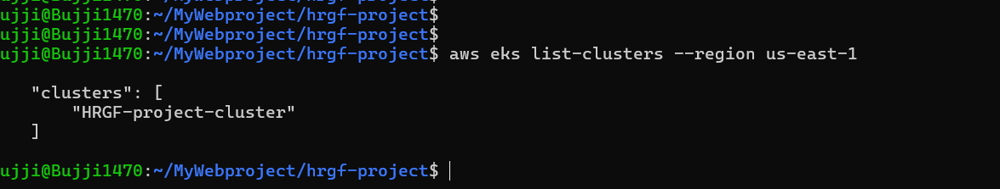
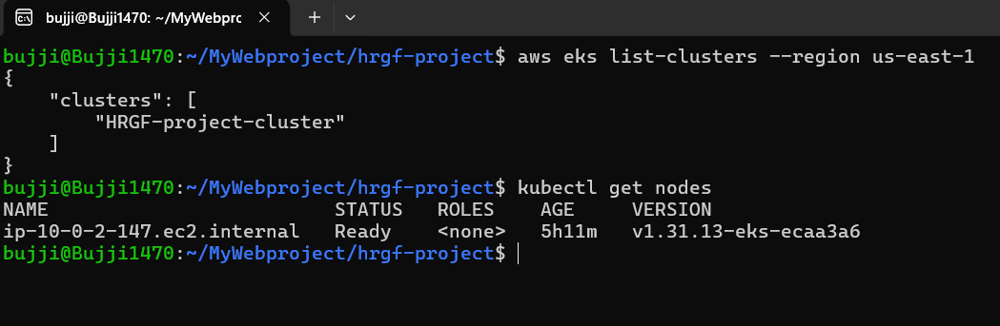
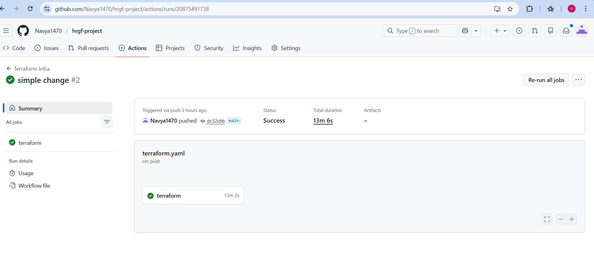
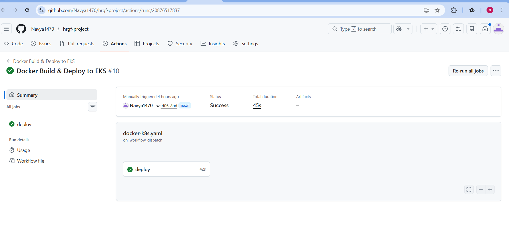
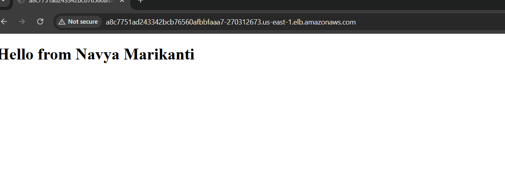

# **HRGF Project - Automated Kubernetes Deployment**

---

## **Overview**

This project demonstrates a fully automated deployment of a simple web application to Kubernetes on AWS. The goal was to implement **Infrastructure as Code**, **containerization**, and a **CI/CD pipeline**, so that any change to the code automatically updates the app running on a Kubernetes cluster.

The app itself is a simple Nginx web page that displays a “Hello” message.

---

## **Tech Stack**

- **Cloud Provider:** AWS (EKS)
- **Infrastructure as Code:** Terraform
- **Containerization:** Docker
- **Orchestration:** Kubernetes
- **CI/CD:** GitHub Actions

---

## **Project Structure**

| Folder / File | Purpose |
| --- | --- |
| `terraform/` | Terraform scripts to provision VPC, EKS cluster, and node groups |
| `docker/` | Dockerfile + `index.html` for the web application |
| `kubernetes/` | Kubernetes Deployment and Service YAMLs |
| `.github/workflows/` | GitHub Actions CI/CD pipelines for Terraform and Docker+K8s |
| `README.md` | Project overview and instructions |

---

## **Workflows & Deployment**

### **1️⃣ Terraform Workflow**

<details>
<summary>Click to expand Terraform Workflow</summary>

**Trigger:** Push changes to `terraform/` folder

**Steps:**

1. Provision VPC with public/private subnets
2. Create EKS cluster with managed node groups

**Commands / Examples:**

```bash
terraform init
terraform validate
terraform apply -auto-approve

```

### Terraform Infrastructure – AWS EKS




### GitHub Actions Pipeline Execution






> Note: Terraform state should ideally be stored in S3 with DynamoDB locking for safe concurrent runs.
> 

</details>

---

### **2️⃣ Docker Build Workflow**

<details>
<summary>Click to expand Docker Build Workflow</summary>

**Trigger:** Push changes to `docker/` folder

**Steps:**

1. Build Docker image from `docker/Dockerfile`
2. Tag and push the image to AWS ECR

**Commands / Examples:**

```bash
# Login to AWS ECR
aws ecr get-login-password --region us-east-1 \
| docker login --username AWS --password-stdin 859012632884.dkr.ecr.us-east-1.amazonaws.com

# Build Docker image
docker build -t hello-app ./docker

# Tag Docker image
docker tag hello-app:latest 859012632884.dkr.ecr.us-east-1.amazonaws.com/hrgf-image-repo

# Push to ECR
docker push 859012632884.dkr.ecr.us-east-1.amazonaws.com/hrgf-image-repo

```

> Best Practice: Only rebuild the Docker image when changes occur in the docker/ folder.
> 

</details>

---

### **3️⃣ Kubernetes Deployment Workflow**

<details>
<summary>Click to expand Kubernetes Deployment Workflow</summary>

**Trigger:** Push changes to `kubernetes/` folder or after Docker workflow completes

**Steps:**

1. Update kubeconfig for EKS
2. Apply Kubernetes manifests from `kubernetes/` folder
3. Rollout deployment updates

**Commands / Examples:**

```bash
# Update kubeconfig
aws eks update-kubeconfig \
    --region us-east-1 \
    --name HRGF-project-cluster
    

# Apply Kubernetes manifests
kubectl apply -f kubernetes/

# Check rollout status
kubectl rollout status deployment hello-app

# Restart deployment if needed
kubectl rollout restart deployment hello-app

# Check services
kubectl get svc

# Check pods
kubectl get pods

```

### Kubernetes Resources





**Note:**

- Service type is **LoadBalancer** for public access
- Deployment automatically updates the app with new Docker images

</details>

---

## **Access the App**

- Use `kubectl get svc` to get the **external LoadBalancer URL**.
- Open the URL in a browser to see the live app.

> Example:
> 
> 
> `http://a8c7751ad243342bcb76560afbbfaaa7-270312673.us-east-1.elb.amazonaws.com`
> 
> 
> 

---

## **Design Choices / Notes**

- Separate workflows for **Terraform**, **Docker**, and **Kubernetes** ensures independent updates.
- Docker images are rebuilt **only when needed**, reducing pipeline time.
- Kubernetes manifests are managed manually (can be enhanced with Helm/Kustomize).
- CI/CD triggers are based on folder paths for efficiency.

---

## **Future Enhancements**

- Use **Helm** or **Kustomize** for templated deployments
- Implement **Secrets Management** for sensitive data
- Add **monitoring/logging** via Prometheus/Grafana
- Add **security scanning** for container images

---

---

## **Live Application Link**

ex: 

`http://<your-ELB-DNS>.us-east-1.elb.amazonaws.com
`


Author

Navya Marikanti
DevOps Engineer


---

## **Thank You**

Thank you for taking the time to review this project.  
I hope this demonstrates my understanding of **DevOps principles**, automated deployment, and CI/CD best practices.  

Feel free to reach out if you have any questions or need a live demonstration of the deployment.

---

